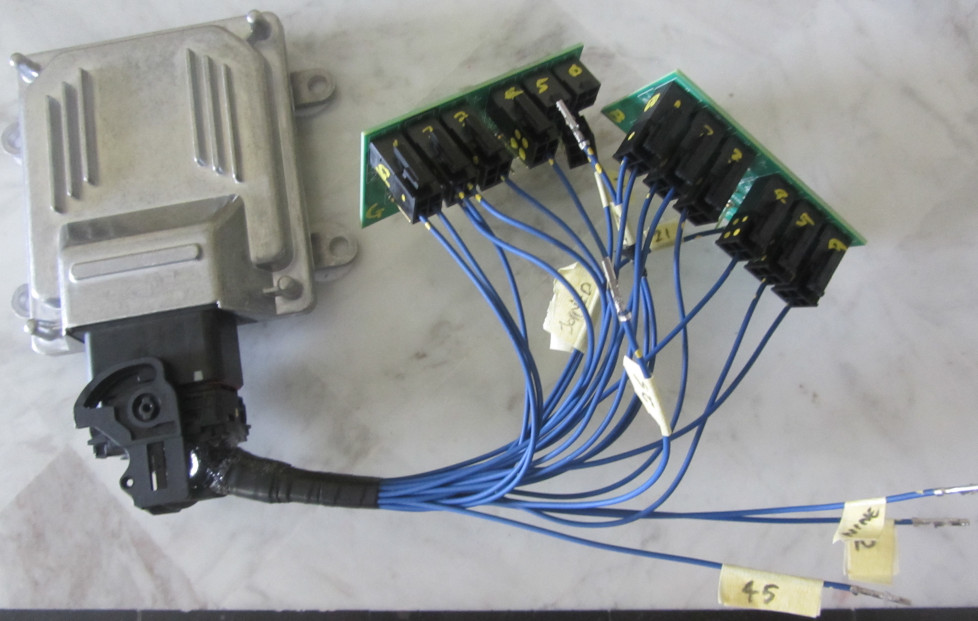
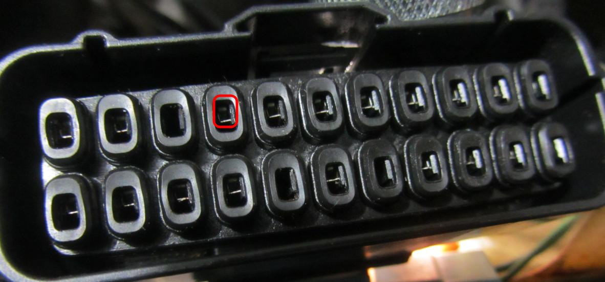

# Honda CBR1100XX Super Blackbird - Wiring harness adapter board

This project incorporates a printed circuit board design that allows you to connect from the OEM Honda CBR1100XX Blackbird wiring harness to your stand-alone ECU of choice.
This adapter board specifically targets the early 2000's model EFI Honda Blackbird.

In my case, it is an Australian 2002 model.

The OEM Keihin ECU contains two groups of 22 connector pins that mate with bikes wiring harness. The harness side contains the two connectors (black and light gray) that the ECU mates with. These 22-pin connectors are proprietary and are located underneath the seat at the rear of the motorcycle.

This PCB design provides a means of conveniently interfacing with the existing 22-pin connector to your specific standalone ECU of choice without having to sever the existing wiring harness.
A custom wiring harness can then be separately built to interface to the stand alone ECU via standard Molex connectors numbered at the top of the board.  The benefit of such an interface board also allows you to revert to the original Keihin ECU if you so wish since it allows the bikes wiring harness to remain undisturbed. 
Note: This will only be the case if the camshaft 3-tooth trigger wheel is also left undisturbed.

Fitment to a motorcycle will require the construction of two PCB's. An example of two completed boards are shown below together with its fitment to the existing wiring harness in place of the Keihin ECU.

Note: This project is in its early stages, so does not discuss packaging or sealing of the boards from the elements at this stage. It is evolutionary in nature and will attempt to improve shortcomings over time as new ideas come to light.

 

### Extra Notes
As of this current version (v0.2a), the 22 x round gold-plated pin connectors on the lower half of the board are the closest match I could find as a replacement to the stock Keihin pins. 
The stock Keihin pins are 1.0mm wide and 0.7mm tall, therefore a rectangular pin. The replacement I have used is a 1.0mm round style pin. It fits into the harness side very snug. The search for a perfect pin match will continue for future boards revisions.

The last picture displays the Honda/Keihin side of the main bikes wiring harness. It is important that the receptacle (receiver side) is correctly mated with the pins on the PCB since it is easy to mis-align. The area of entry is shown in red. Therefore care must be taken with the pin alignment as the boards are plugged into the black and gray harness side connectors on the bike. The connection will be on the tight side due to the 1.0mm round pins, but they will work.

The pin spacings on the Keihin 22-way connector are 8.5mm in the vertical and 5.8mm horizontally.

The upper half of the board contains a series of 6 x 4-way Molex connectors. The connectors are part of the 'Mini Fit Jnr' family of Molex connectors. The example shown above uses automotive 20 AWG wire. The choice to use many smaller connectors rather than a single 24 way connector was mainly due to stock availability. The 4-way connectors are very common.

 

### Project Details

<table border="1">

<tr> 
<td width="20%">
<strong><u>Current Revision</u></strong>
</td>
<td width="60%">
<strong><u>Date</u></strong>
</td>
<td width="20%">
<strong><u>Author</u></strong>
</td>
</tr>

<tr>
<td width="20%">
v0.2a
</td>
<td width="60%">
Jan 2026
</td>
<td width="20%">
Alex Kiaos
</td>
</tr>

</table>

 

This project has been designed in Kicad 6.0.11 under linux and is licensed under the TAPR Open Hardware License (www.tapr.org/OHL).  

The directory structure of this project is as follows:

<table border="1">

<tr> 
<td width="20%">
<strong><u>Directory</u></strong>
</td>
<td width="80%">
<strong><u>Description</u></strong>
</td>

</tr>

<tr>
<td width="20%">
BOM
</td>
<td width="80%">
Bill of materials
</td>
</tr>

<tr>
<td width="20%">
datasheets
</td>
<td width="80%">
Data sheets for pins and connectors
</td>
</tr>

<tr>
<td width="20%">
images
</td>
<td width="80%">
Various images, pictures, board renditions
</td>
</tr>

<tr>
<td width="20%">
kicad
</td>
<td width="80%">
The main kicad project folder. 
This contains the project itself (uses kicad 6.0.11) 
The main project file is 'CBR_AdapterBoard.kicad_pro' found under '/pcb/kicad/CBR_AdapterBoard'.  
Gerber files can be found as a group of 9 individual files under the 'gerbers' folder or as a single zipped file under the 'gerber_zipped' folder for uploading to a PCB house for manufacture.  
The 'CustomLibrary' folder contains the custom symbols and footprints used in the project.
</td>

</table>

 

After cloning the repository and opening the project for the first time, you may need to set up the symbol and footprint library paths.

To setup the symbols library, in the menu: 
<pre><i>Preferences -> Manage Symbol Libraries</i> 
  Then in the 2nd tab under 'Project specific libraries' add the following: 
Nickname: <b>Blackbird</b> 
Library Path: <b>${KIPRJMOD}/../CustomLibrary/symbols/Blackbird_symbols.kicad_sym</b> 
</pre>
  

To setup the footprint library, in the menu: 
<pre><i>Preferences -> Manage Footprint Libraries</i> 
  Then in the 2nd tab under 'Project specific libraries' add the following 
Nickname: <b>Blackbird</b> 
Library Path: <b>${KIPRJMOD}/../CustomLibrary/footprints/</b> 
</pre>
 

# Relevant links

### PCBWay
To visit the PCBWay project and/or place an [order](https://www.pcbway.com/project/shareproject/Honda_CBR1100XX_Super_Blackbird_ECU_adapter_board_for_a_standalone_ECU_a730cd35.html).

### Wiring Harness & Pinouts
To see the ECU pin-out details, refer to the latest pdf file at:
[Wiring Harness Pinout diagram](https://github.com/BlackbirdStandalone/Documentation/tree/main/wiring).

